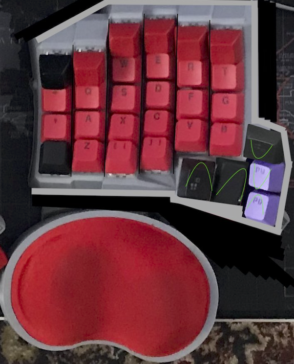
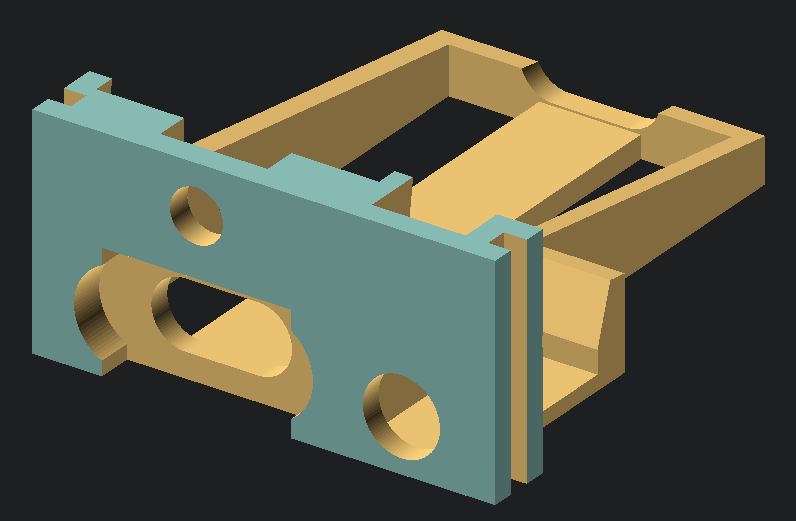

# Deractyl - Another Compact Dactyl ManuForm Keyboard with a different thumb cluster

This is a fork of [my original Compactyl fork](https://github.com/dereknheiley/dactyl-manuform-tight/), of [the okke fork](https://github.com/okke-formsma/dactyl-manuform-tight) of the [l4u fork](https://github.com/l4u/dactyl-manuform-mini-keyboard)of the [tshort fork](https://github.com/tshort/dactyl-keyboard) of the [Dactyl](https://github.com/adereth/dactyl-keyboard), a parameterized, split-hand, concave, columnar, ergonomic keyboard.

## Goals
- New thumb design to try and combine benefits of dactyl and dactyl manuform thumb clusters
- Integrate adjustable wrist rest
- Fine tune column Z stagger as needed around new tenting angle
- Increase tenting angle & adjust minor things like screw inserts

## Generate OpenSCAD and STL models short version
* Make changes to `src/dactyl_keyboard/dactyl.clj`
* Install `lein` and `OpenScad`
* Ensure script is executable `chmod 744 ./create-models.sh`
* run `./create-models.sh`
* wait for new STL files to generate in `things/` folder

## Generate OpenSCAD and STL models old long boring version

* Run `lein repl`
* In the repl run `(load-file "src/dactyl_keyboard/dactyl.clj")`
* This will regenerate the `things/*.scad` files
* Use OpenSCAD to open a `.scad` file.
* Make changes to design, repeat `load-file`, OpenSCAD will watch for changes and rerender.
* When done, use OpenSCAD, press F6 to render, then F7 to export model STL files
* Open STL files and 3d print usnig slicing software such as IdeaMaker (or Cura, or PrusaSlicer, etc).

## Tips

* When trying things out, 10 seconds of rendering time in OpenSCAD is really annoying. Load one of the test outputs with commented out parts that you don't use.
* If you're not sure what things are generted by a piece of code, color them in using something like
`(->> SOMETHING_HERE (color RED))` (see examples in dactyl.clj).

## License

Copyright © 2015-2021 Matthew Adereth, Tom Short, Leo Lou, Okke Formsma, Derek Nheiley

The source code for generating the models is distributed under the [GNU AFFERO GENERAL PUBLIC LICENSE Version 3](LICENSE).

The generated models are distributed under the [Creative Commons Attribution-ShareAlike 4.0 International (CC BY-SA 4.0)](LICENSE-models).
